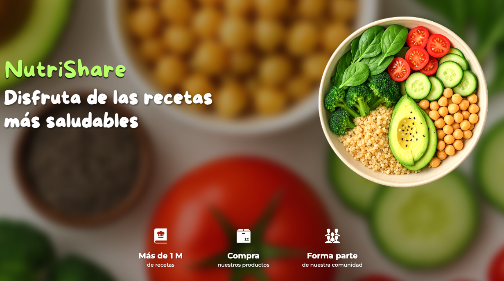
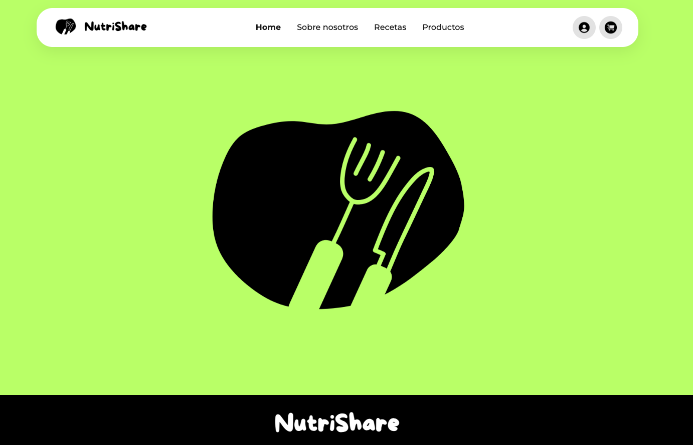
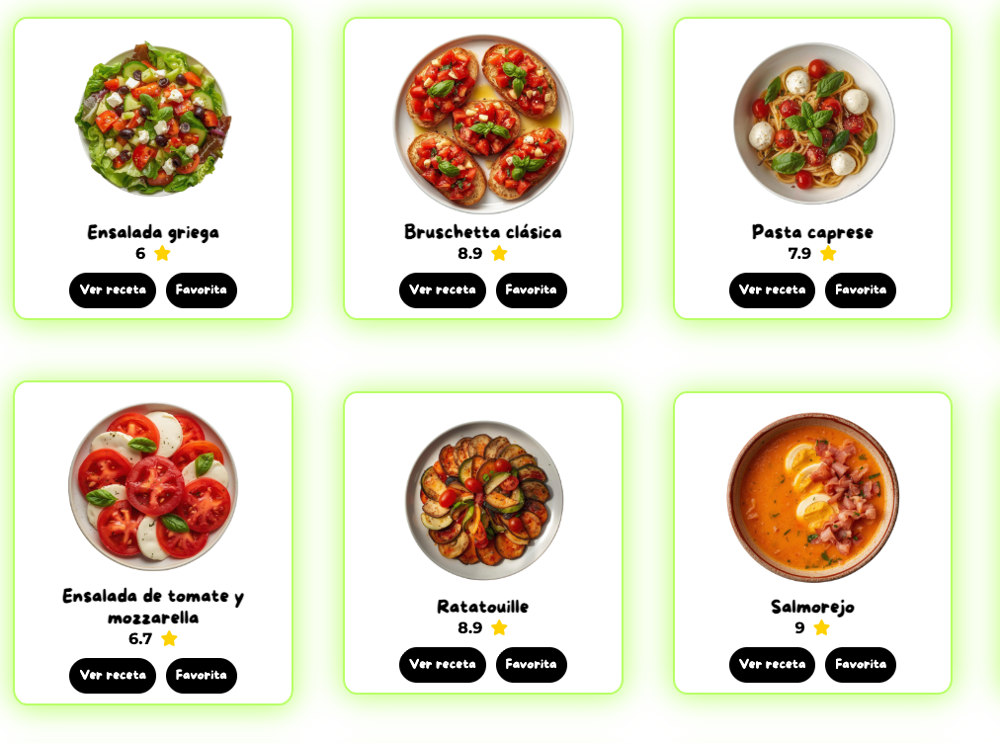
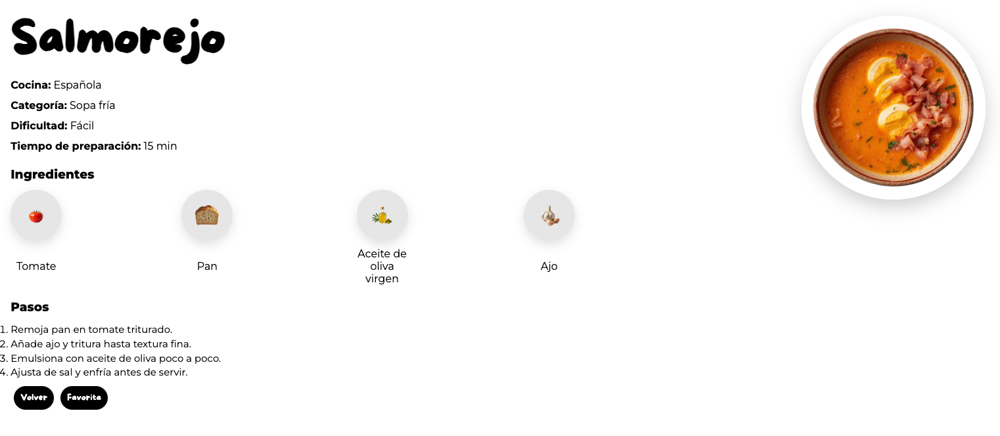
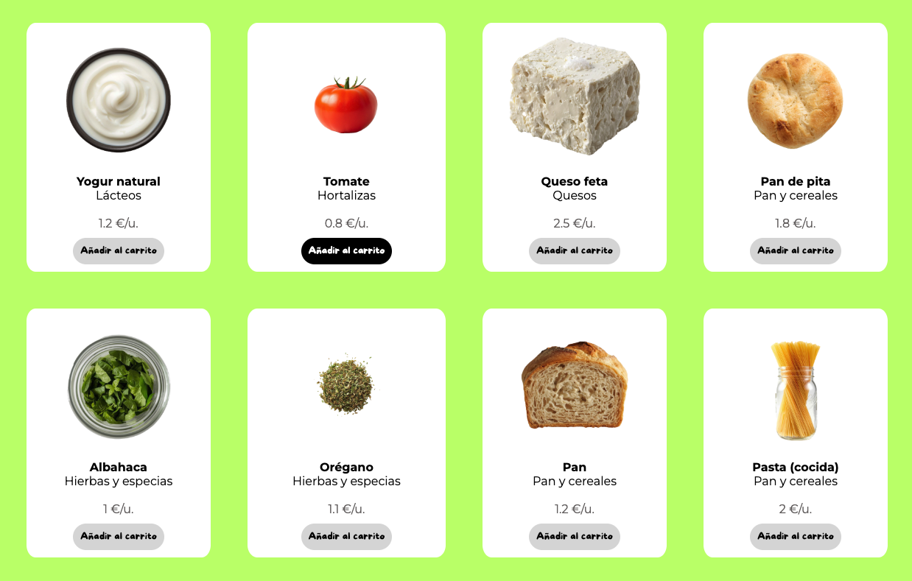
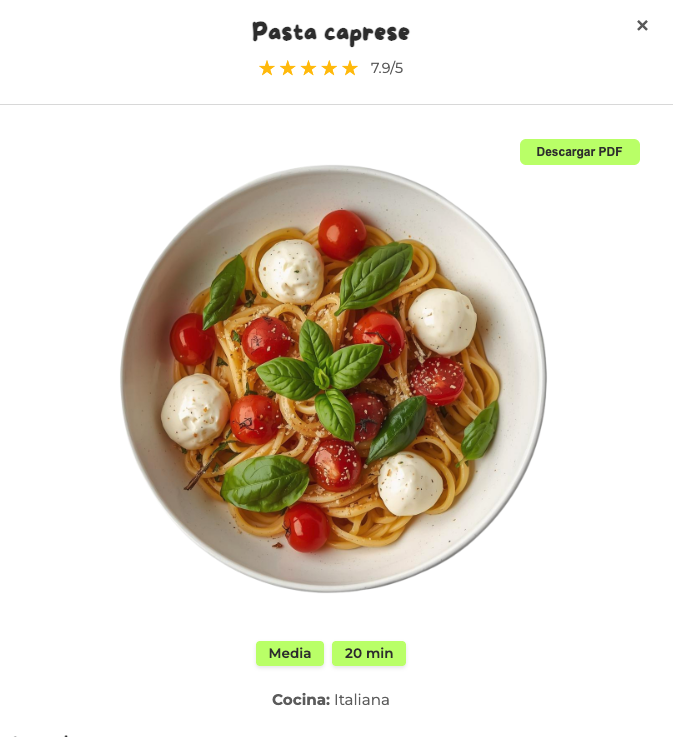
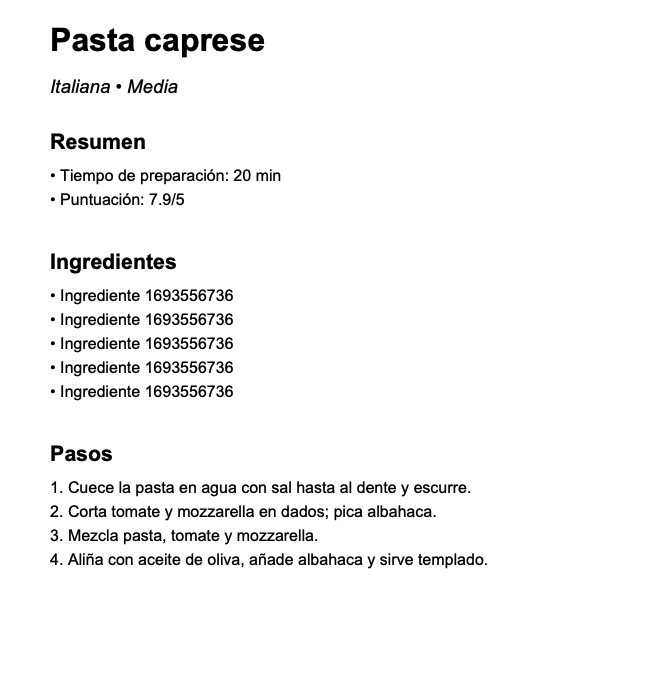

**NutriShare** es una aplicación web diseñada para gestionar recetas de cocina de forma sencilla y saludable.

La plataforma permite a los usuarios descubrir, crear, editar y eliminar sus propias recetas, fomentando el intercambio de hábitos alimenticios en una comunidad digital.

Como funcionalidad destacada, el sistema permite la descarga de recetas en formato PDF, facilitando que cada usuario pueda guardarlas o imprimirlas para su uso diario.

**Dirección web:** [https://nutri-share.com/](https://nutri-share.com/)



## Tecnologías principales

- Angular 20
- TypeScript
- RxJS
- Angular Router
- Angular Forms
- pdf-lib

## Funcionalidades incluidas

- Autenticación de usuarios (login y registro)
- Gestión de sesión con token en `localStorage`
- Listado y filtrado de recetas
- Vista de detalle de receta
- Creación, edición y eliminación de recetas
- Perfil de usuario con actualización de datos
- Generación de PDF para recetas

## Requisitos

- Node.js 20+
- npm 10+
- Angular CLI 20+

## Instalación y ejecución

1. Instalar dependencias:

```bash
npm install
```

1. Ejecutar en desarrollo:

```bash
npm start
```

## Funcionalidades principales

### Home



### Listado de recetas



### Detalle de receta



### Listado de ingredientes



### Generación de PDF



### Detalle de PDF



---

## Integrantes

- Sara Martínez Fernández
- Irene Martínez Iglesias
- Ruth Guamán Albarracín

Proyecto Intermodular de Desarrollo de Aplicaciones Web
